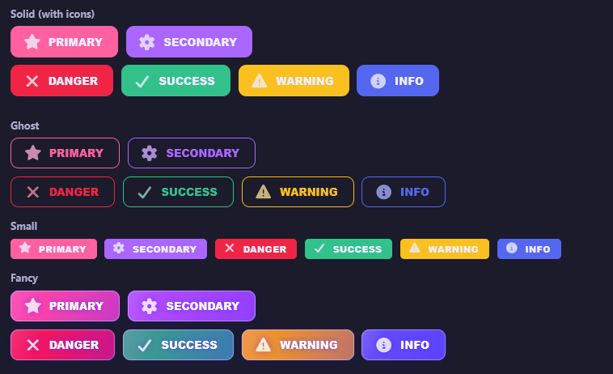
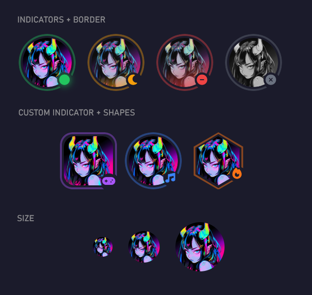
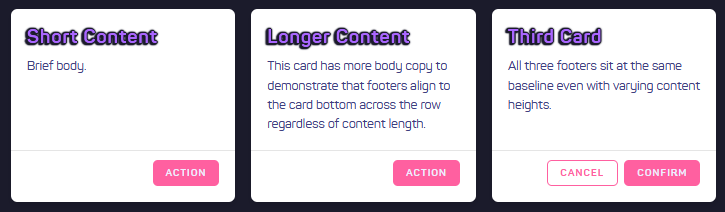
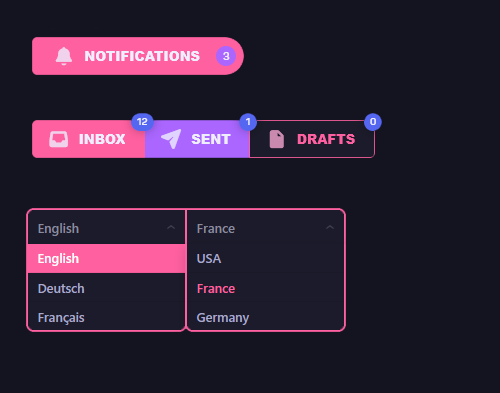
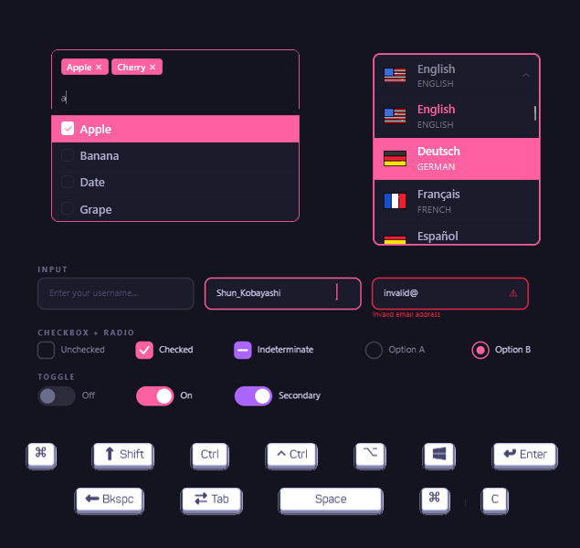
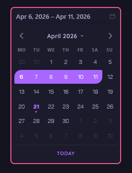

# Stardust UI

Overhaul of the component library and design system powering the [Pollux](https://pollux.gg) (community social platform/chatbot) dashboard. Built with **Vue 3**, **TypeScript**, **Vite**, and **Storybook 10**.

## This is still a Work In Progress, part of the dashboard overhaul, standardizing pages and components across the site.

---

## ToDo's:
 - [ ] Consolidate use of molecules between components
 - [ ] Properly separate Pollux-specific solutions in organisms
 - [ ] Improve a11y
 - [ ] Finish porting all components
 - [ ] Polish currently copied-over components that hasn't been fully updated
 - [ ] Separation of concerns of some functionality (eg Gravity-DnD)
 - [ ] Revisit some overly-generic components
 - [ ] Add missing functionality added ad-hoc to the original site
 - [ ] Add missing components that weren't fully imported
 - [ ] Overhaul color design system using tiered identidy layers
 - [ ] Overhaul tokenization of colors, margins, sizes, etc
 - 

## Visual demos

### Button — solid · ghost · small · fancy, all theme variants



### Avatar — status indicators · shapes · sizes



### Card — grid layout with aligned footers



### GlueContainer — badge + tabs with counters + dropdown select



### Form elements — Multi-select · Searchable select · Input · Checkbox · Radio · Toggle · Key



### DatePicker — range selection




---

## Component catalog

### Stardust UI — core components

| Component | Description |
|---|---|
| **Button** | Themed, variant-aware (`solid` / `ghost` / `fancy`), sizes `sm` / `md` / `lg`, icon support via Font Awesome |
| **Badge** | Numeric or text indicator, composable inside other elements |
| **Avatar** | User avatar with shape (`circle` / `rounded` / `hexagon`), status indicator, and border ring |
| **Card** | Content surface with header / body / footer slots |
| **Alert** | SweetAlert2-integrated feedback dialogs |
| **Accordion** | Collapsible content sections |
| **Tabs** | Tab group with lazy-render panel support |
| **Modal** | Overlay dialog with slot-based content |
| **Offcanvas** | Slide-in side panel |
| **Tooltip** | Lightweight hover/focus tooltip |
| **Progress** | Progress bar with percentage, theme, and size props |
| **Spinner** | Loading indicator |
| **Tag Pill** | Dismissible or static label pills |
| **Key** | Keyboard key visualizer |
| **SuperShadow** | Ambient shadow effect container |
| **GlueContainer** | Layout utility with gap / align / direction props |
| **MegastrokeMenuItem** | Large-format navigation / menu entry |

### Form elements

| Component | Description |
|---|---|
| **Input** | Text / number / password input with validation state |
| **Checkbox** | Styled checkbox with label |
| **Radio** | Radio group |
| **Toggle** | Switch/toggle control |
| **Select** | Native-enhanced select |
| **SelectButton** | Button-group style option picker |
| **DatePicker** | Calendar-based date selection |
| **Dropdown Select** | Floating list dropdown |
| **Searchable Select** | Dropdown with text search |
| **Multi Select** | Multi-value dropdown with chip output |
| **Dropdown Select Plus** | Extended dropdown with grouping and icons |

### Application components

| Component | Description |
|---|---|
| **Typography** | Type scale and text style primitives |
| **ArtistTag** | Branded user/artist attribution tag |
| **Medal** | Achievement medal display |
| **Gem** | Gem currency display |
| **RarityIcon** | Item rarity indicator icon |
| **RarityboxButton** | Lootbox / raritybox open action button |
| **RarityboxCard** | Card displaying a raritybox item result |
| **DeckSkinShowcase** | Profile card skin preview |
| **DraggableMedalGrid** | Drag-and-drop medal arrangement grid |
| **UserSidebar** | Full user profile sidebar layout |
| **ProfileEdit** | Profile editing form layout |

### Themes

Ten built-in color themes switchable at runtime via CSS custom properties:

`pollux` · `borealis` · `australis` · `noctix` · `cecily` · `arsenika` · `nikoliny` · `lunanuli` · `selenedi` · `boring-corporate`

---

## Usage

```vue
<script setup lang="ts">
import Button from '@/ui/stardust-ui/Button/Button.vue';
import Badge  from '@/ui/stardust-ui/Badge/Badge.vue';
import Avatar from '@/ui/stardust-ui/Avatar/Avatar.vue';
</script>

<template>
  <Avatar src="https://example.com/avatar.png" :size="64" shape="circle" status="online" />

  <Button theme="primary" variant="solid" icon="fas fa-check" label="Save changes" />
  <Button theme="danger"  variant="ghost"  icon="fas fa-trash" label="Delete" />

  <span class="relative inline-block">
    <Button theme="secondary" variant="solid" label="Notifications" />
    <Badge :value="4" class="absolute -top-2 -right-2" />
  </span>
</template>
```

Apply a theme by adding the class to any ancestor element (typically `<body>` or your root app container):

```html
<body class="theme-pollux">...</body>
```

---

## Run locally

```bash
npm install
npm run storybook        # dev server on http://localhost:6006
npm run build-storybook  # static build → storybook-static/
```

---

## Sync with dashboard

Source files (`src/ui/`, `src/stories/`, `src/assets/fonts.css`, `src/assets/tailwind.css`, `.storybook/` except `main.ts`) are automatically synced from the `PolestarLabs/dashboard` `dash-v3` branch via GitHub Actions.

Config files (`package.json`, `tsconfig.json`, `vite.config.ts`, `tailwind.config.cjs`, `postcss.config.cjs`, `.gitignore`, `src/env.d.ts`, `src/shims-vue.d.ts`, `.storybook/main.ts`) are managed manually in this repository and are **never overwritten** by the sync workflow.
